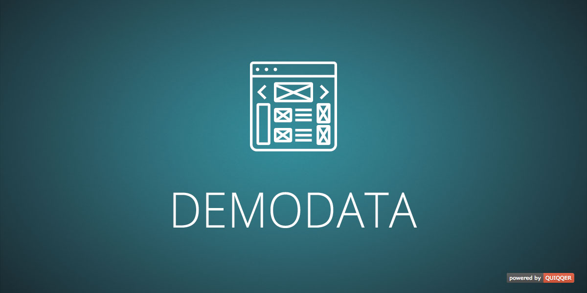
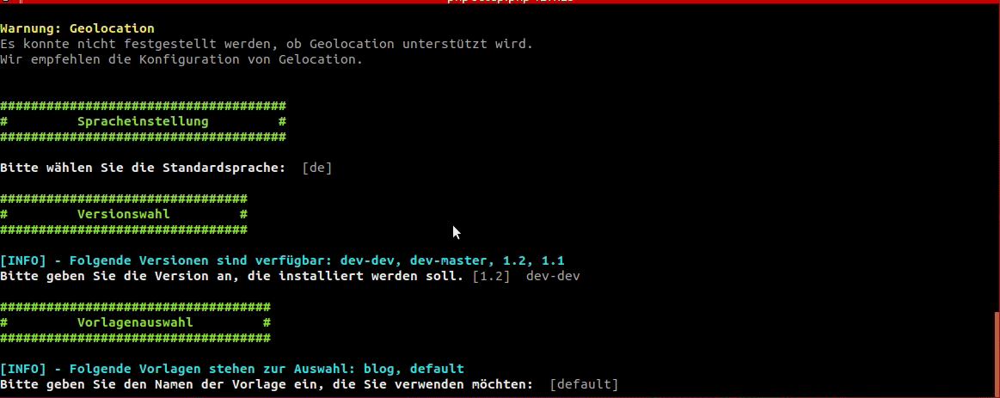
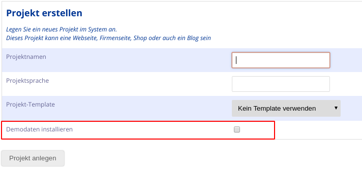

Adds an API to add demodata on project creation.

Paketname:

    quiqqer/demodata


Features (Funktionen)
--------

Ermöglicht es Entwicklern Demodaten bereitzustellen, die der Benutzer bei der Projekterstellung installieren lassen kann.


## Verwendung
Dem Benutzer wird anschließend angeboten die Demodaten zu installieren

### Konsolensetup


### Projekterstellung



Installation
------------

Der Paketname ist: quiqqer/demodata

```
    php composer.phar require quiqqer/demodata
```


Mitwirken
----------

- Issue Tracker:  https://dev.quiqqer.com/quiqqer/demodata/issues
- Source Code: https://dev.quiqqer.com/quiqqer/demodata/


Support
-------

Falls Sie einen Fehler gefunden haben oder Verbesserungen wünschen,
senden Sie bitte eine E-Mail an support@pcsg.de.


Lizenz
-------

Entwickler
-------
https://dev.quiqqer.com/quiqqer/demodata/wikis/home


